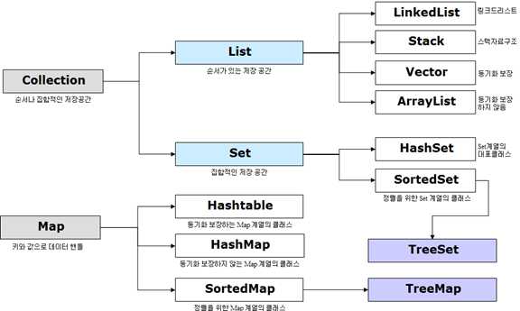

내가 몰랐던것들을 정리하는 공간
=============================

리터럴
-------
소스코드의 고정된 값.
```
//예) 
int a = 1; 
//여기서 1이 리터럴
```
(변수나 상수는 메모리에 할당된 공간, 리터럴은 그곳에 저장되는 값)

인스턴스
--------
객체를 소프트웨어에 실체화한것. 실체화하였을때 인스턴스는 메모리에 할당.

예)
```
/* 클래스 */
public class Animal {
  ...
}
/* 객체와 인스턴스 */
public class Main {
  public static void main(String[] args) {
    Animal cat, dog; // '객체'

    // 인스턴스화
    cat = new Animal(); // cat은 Animal 클래스의 '인스턴스'(객체를 메모리에 할당)
    dog = new Animal(); // dog은 Animal 클래스의 '인스턴스'(객체를 메모리에 할당)
  }
}
```
https://gmlwjd9405.github.io/2018/09/17/class-object-instance.html

컬렉션
------
여러 원소들을 담을수있는 자료구조.
배열과의 차이점은 동적메모리할당이 가능하다는 점.

